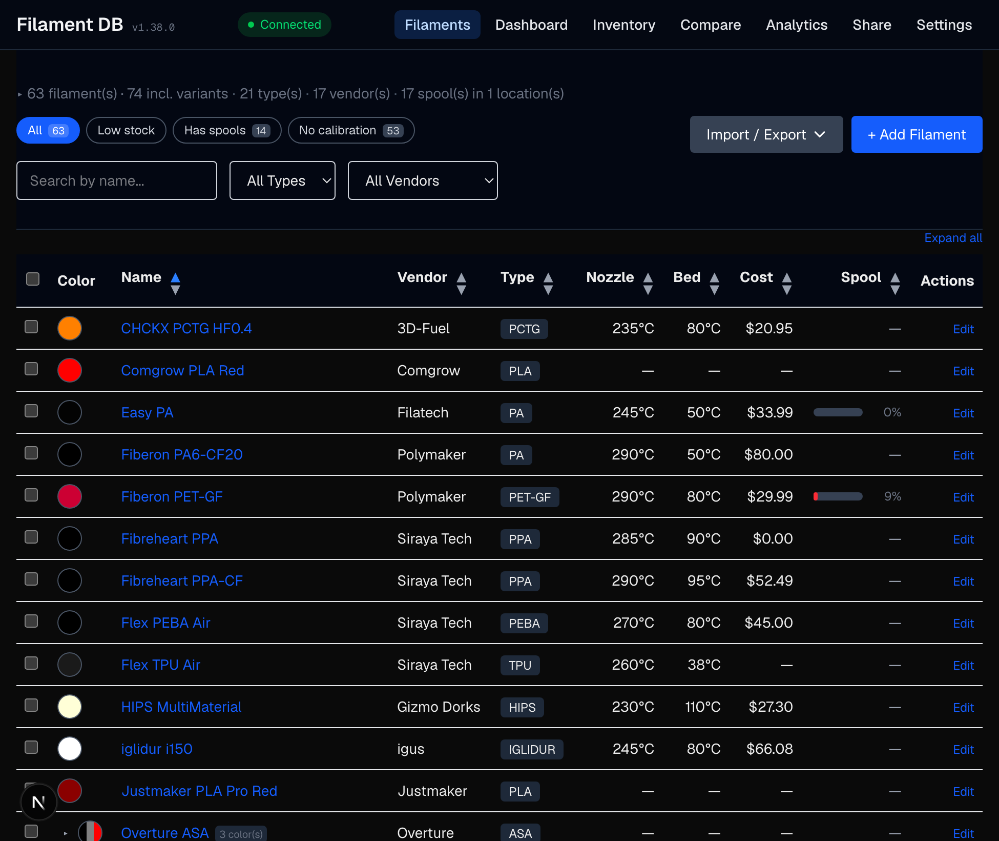

# Filament DB

A desktop and web application for managing 3D printing filament profiles. Import filament configurations from PrusaSlicer, store them in MongoDB or MongoDB Atlas, and manage them through a clean interface. The desktop app reads and writes [OpenPrintTag](https://openprinttag.io/) NFC tags (NFC-V / ISO 15693) and reads Bambu Lab MIFARE Classic spool tags via an ACR1552U reader, so you can scan a spool to autofill a profile or write your own per-spool tags. Available as an installable desktop app for macOS, Windows, and Linux, or run as a local web app. The desktop app supports offline mode with an embedded local database, hybrid mode with automatic cloud sync, or direct Atlas cloud mode. The API is unauthenticated and intended for single-user localhost use; do not expose to untrusted networks without adding an auth layer.



## Features

### Filament Management
- **Browse and search** -- filterable, sortable table with color swatches and collapsible statistics (by type, vendor, color)
- **Full CRUD** -- create, view, edit, and delete filament profiles with temperatures, fan settings, shrinkage, retraction, pressure advance, abrasive/soluble flags, and notes
- **Material properties** -- glass transition temperature (Tg), heat deflection temperature (HDT), shore hardness (A/D), nozzle temp ranges, print speed ranges, per-bed-type temperatures
- **Slicer parity** -- OrcaSlicer/BambuStudio/PrusaSlicer settings: overhang fan, aux fan, layer time thresholds, MMU/AMS params, start/end G-code, z-offset, air filtration
- **Color variants** -- clone a filament as a color variant; inherited settings resolve automatically from the parent
- **Presets** -- named parameter variants per filament (e.g., shore hardness profiles with different temps and extrusion multiplier)
- **Spool tracking** -- track multiple spools per filament with individual weights, lot numbers, purchase/opened dates, photos, location assignment, printer-slot assignment, retirement flag, dry-cycle log, and per-spool usage history
- **Locations** -- dedicated collection for dryboxes / shelves / cabinets / AMS slots with optional humidity readings; every spool can be assigned to one
- **Low-stock thresholds** -- per-filament grams threshold surfaces inventory warnings on the dashboard and filament list chips
- **Dashboard** -- at-a-glance counts, low-stock warnings, "needs drying" reminders, and shortcut links to every section
- **Spool Inventory** -- companion lens to the filament list (`/inventory`): same data, opposite grouping. Where the filament list groups spools under their filament, this page groups filaments under their LOCATION (shelf / drybox / cabinet) so you can audit a physical location at a glance — inline weight editing, move-to dropdown, and retire toggle on each row without bouncing to per-filament pages
- **Usage analytics** -- 7–365 day rolling window of grams consumed, cost, and jobs, broken down by day / filament / vendor / printer; draws from PrintHistory records plus manual per-spool entries
- **Technical Data Sheets** -- link vendor TDS documents with inline preview pane and auto-suggestions from same-vendor filaments
- **AI-powered TDS import** -- extract filament properties (temperatures, density, drying specs, Tg, HDT, shore hardness, speeds) from PDF or web TDS using Google Gemini, Anthropic Claude, or OpenAI ChatGPT
- **Material defaults backfill** -- script to populate Tg, HDT, density, drying params, and speed ranges from curated defaults for 30+ material types

### Hardware Integration
- **Printers** -- define printers with manufacturer, model, and installed nozzles
- **Nozzles** -- define nozzles by diameter, type, high-flow, and hardened attributes; each physical nozzle is installed in at most one printer at a time
- **Bed types** -- define bed surfaces (Smooth PEI, Textured PEI, G10/FR4, Glass, etc.) for per-bed-type calibration
- **Per-printer per-nozzle per-bed-type calibration** -- store EM, max volumetric speed, pressure advance, retraction, temperature overrides, and fan settings per printer/nozzle/bed-type combination
- **NFC tag read/write/erase** -- read, write, and erase [OpenPrintTag](https://openprinttag.io/) NFC-V (ISO 15693) tags and read Bambu Lab MIFARE Classic spool tags using an ACR1552U reader (desktop app)
- **NFC scan → slicer preset** -- live Server-Sent Events stream at `GET /api/scan/stream` emits each tag read so a subscribed PrusaSlicer / OrcaSlicer FilamentDB module can auto-select the matching filament preset by name; the most recent scan replays on connect so a slicer opened just after a tag read still picks it up
- **Instance IDs** -- unique per-filament identifier (5-byte hex, Prusament-compatible), written to NFC tags
- **Label printer (Brother PT-P710BT)** -- print a 24mm-tape spool label directly from the filament detail page over Bluetooth; QR encodes either the spool instance ID (compact, re-scans into the match endpoint) or a deep-link URL to the filament's detail page (configurable per print, sticky default). Bitmap is rendered renderer-side and serialized via the Brother raster command set; runtime watchdog closes the serial port on any stall. Pair once via System Settings → Bluetooth, then pick the device under Settings → Label Printer; the same code path supports a `Print` button in the dialog (Electron) or a `.bin` download for offline inspection via the `npm run label:sim` simulator (web)

### Sharing & Comparison
- **Shared catalogs** -- publish a static snapshot of selected filaments (with referenced nozzles/printers/bed-types) under a short public slug so another user or machine can import the set. Atomic view counts. Optional expiry.
- **Compare view** -- side-by-side comparison of up to N filaments: temperatures, cost, density, calibrations, and calculated remaining material
- **Print history** -- per-job ledger of grams consumed across multi-material prints, filterable by printer or filament, feeds the analytics dashboard

### Import / Export
- **PrusaSlicer** -- import and export INI config bundles via browser upload or CLI
- **Bambu Studio** -- import a Bambu Studio `.json` filament preset directly. Single-preset sync from the filament detail page (matches by id, ignores parsed name), or upload one preset at a time via the `/import-export` Bambu tile. Preserves variant inheritance + auto-detects calibration context from the preset's `printer_settings_id`. Round-trip safe: export → re-import is lossless even for slicer keys the app doesn't model
- **OrcaSlicer** -- export as a bundle (`GET /api/filaments/orcaslicer`) or per-preset (`GET /api/filaments/{id}/orcaslicer`). Per-preset import works via `POST /api/filaments/{id}/orcaslicer` for the FilamentDB sync module, but there's no UI "Sync from OrcaSlicer" button yet. Bulk import is stubbed at 501 pending a future PR
- **Bulk spool import** -- paste or upload a CSV of spool rows (filament, weight, vendor, lot, dates, location); auto-creates missing locations and reports per-row errors
- **PrusaSlicer Filament Edition** -- live bidirectional sync of filament presets with [PrusaSlicer Filament Edition](https://github.com/hyiger/PrusaSlicer) via REST API; presets appear in the filament dropdown on startup, changes sync back with per-nozzle calibration context, and calibration overrides are applied dynamically when switching printers/nozzles
- **OpenPrintTag database** -- browse the [OpenPrintTag community database](https://github.com/OpenPrintTag/openprinttag-database) (thousands of FDM materials from many brands; live counts shown in the UI), filter by type/brand/data quality, and selectively import filaments with completeness scoring
- **CSV / XLSX** -- import and export spreadsheets with column mapping
- **Prusament QR** -- scan a spool QR code or enter spool ID to auto-import specs, temps, weights, and pricing
- **Import from Atlas** -- connect to a remote MongoDB Atlas database and selectively import filaments
- **TDS extraction** -- paste a TDS URL to auto-populate the filament form via AI (Gemini, Claude, or ChatGPT)
- **OpenPrintTag binary** -- download `.bin` files with drying temps, transmission distance (HueForge TD), and instance ID
- **Snapshot backup/restore** -- export and import core app data (filaments, nozzles, printers, bed types, locations, print history, and shared catalogs) as JSON with best-effort rollback on failure

### Desktop App
- **Multi-language support** -- English and German, with easy addition of new languages
- **System theme** -- light/dark/system toggle with no-flash init script; respects OS `prefers-color-scheme` in system mode
- **Cross-platform** -- installable on macOS (.dmg), Windows (.exe), and Linux (.AppImage, .deb) including arm64 for Raspberry Pi
- **Offline mode** -- embedded local MongoDB; choose cloud-only, hybrid, or fully offline
- **Atlas sync** -- automatic bidirectional sync with MongoDB Atlas using last-write-wins conflict resolution; covers filaments (with embedded spools), nozzles, printers, locations, bedtypes, printhistories, and sharedcatalogs with cross-DB ref remap (calibrations, AMS slots) and soft-delete tombstone propagation
- **Hardened external URL handling** -- Electron `setWindowOpenHandler` only forwards `http(s)` to the OS shell (not `file:` / `javascript:` / custom protocols); render-time guards on TDS / photo / product links; `tdsUrl` schema-validated to http(s) on every write path; TDS extractor follows redirects manually with per-hop SSRF re-checks (5-redirect cap)
- **Auto-update** -- in-app banner announces new versions, downloads in the background, and prompts to restart-and-install (localized); falls back to the GitHub release page on macOS since Gatekeeper blocks unsigned auto-install

### Developer
- **REST API** -- full CRUD endpoints for filaments, nozzles, printers, and bed types
- **PrusaSlicer API** -- `GET /api/filaments/prusaslicer` exports filaments as a PrusaSlicer-compatible INI config bundle (one section per filament); calibration overrides are applied dynamically via `GET /api/filaments/{id}/calibration`; `POST` imports bundles back
- **Scan stream (SSE)** -- `GET /api/scan/stream` Server-Sent Events feed and `POST /api/scan/publish` for fanning NFC tag reads to slicer integrations or other subscribers in real time
- **API documentation** -- API reference plus interactive Swagger UI at `/api-docs` with an OpenAPI 3.0 spec for the documented REST surface

## Tech Stack

- [Electron](https://www.electronjs.org/) (desktop packaging)
- [Next.js](https://nextjs.org/) (App Router, TypeScript)
- [MongoDB Atlas](https://www.mongodb.com/atlas) (cloud, optional) / embedded local MongoDB (offline/hybrid)
- [Mongoose](https://mongoosejs.com/) ODM
- [Tailwind CSS](https://tailwindcss.com/)
- [Vitest](https://vitest.dev/) (coverage enforced on `src/lib/` and `src/models/`)

## Quick Start

### Desktop App (recommended)

Download the latest release for your platform from [GitHub Releases](https://github.com/hyiger/filament-db/releases). On first launch, the app will prompt you to choose a connection mode (cloud, hybrid, or offline). No MongoDB Atlas account is needed for offline mode.

### Docker

```bash
docker run -p 3456:3000 -e MONGODB_URI="mongodb+srv://..." ghcr.io/hyiger/filament-db
```

Open http://localhost:3456. See the [Setup Guide](docs/setup.md#option-2-docker) for Docker Compose and configuration options.

### From Source

```bash
git clone https://github.com/hyiger/filament-db.git
cd filament-db
npm install
cp .env.example .env.local   # then edit with your MongoDB Atlas connection string
npm run dev                   # web app at http://localhost:3456
npm run electron:dev          # or run as desktop app
```

See the [Setup Guide](docs/setup.md) for detailed instructions.

## Documentation

| Document | Description |
|----------|-------------|
| [Tutorial](docs/tutorial.md) | Step-by-step walkthrough of every feature, from first launch to NFC |
| [Setup Guide](docs/setup.md) | Installation, Docker, MongoDB Atlas setup, running as web or desktop app, Linux systemd service |
| [Desktop App](docs/desktop.md) | Electron desktop app: building, packaging, and releasing |
| [Importing & Exporting](docs/importing.md) | PrusaSlicer config export, web UI import, CLI seed script, INI export |
| [Usage Guide](docs/usage.md) | Browsing, filtering, sorting, editing filaments, nozzle management, calibrations, TDS links |
| [NFC Tags](docs/nfc.md) | Reading/writing OpenPrintTag and reading Bambu Lab NFC spool tags with the ACR1552U reader |
| [API Reference](docs/api.md) | REST API endpoints for Filament DB, plus the documented OpenAPI surface used by the [interactive Swagger UI](/api-docs) |
| [Testing](docs/testing.md) | Running tests, coverage thresholds, CI/CD with GitHub Actions |
| [Troubleshooting](docs/troubleshooting.md) | Common errors and solutions |

## Project Structure

```
filament-db/
├── docs/                    # Documentation (setup, usage, API, desktop, testing, troubleshooting)
├── electron/                # Electron main process + preload (bundled by esbuild)
├── scripts/                 # CLI tools (seed import, icon generator, filament merge)
├── src/
│   ├── app/
│   │   ├── api/filaments/      # Filament REST API (CRUD, import, export, match, types, vendors, parents)
│   │   ├── api/nozzles/        # Nozzle REST API (CRUD)
│   │   ├── api/bed-types/      # Bed Type REST API (CRUD)
│   │   ├── api/printers/       # Printer REST API (CRUD)
│   │   ├── api/locations/      # Location REST API (v1.11)
│   │   ├── api/print-history/  # Print job ledger (v1.11)
│   │   ├── api/analytics/      # Usage analytics aggregation (v1.11)
│   │   ├── api/share/          # Public shared catalogs (v1.11)
│   │   ├── api/spools/         # Bulk spool CSV import + export (v1.11); printer-slot assignment (v1.21)
│   │   ├── api/prusament/      # Prusament spool scraping and import
│   │   ├── api/openprinttag/   # OpenPrintTag database browser and import
│   │   ├── api/tds/            # AI-powered TDS extraction (Gemini/Claude/OpenAI)
│   │   ├── api/setup/          # Connection test endpoint (for desktop setup wizard)
│   │   ├── api-docs/           # Interactive Swagger UI (OpenAPI 3.0)
│   │   ├── setup/              # First-launch setup wizard
│   │   ├── dashboard/          # Inventory / low-stock dashboard (v1.11)
│   │   ├── inventory/          # Spool inventory page grouped by location (v1.32)
│   │   ├── locations/          # Location management pages (v1.11)
│   │   ├── analytics/          # Usage analytics charts (v1.11)
│   │   ├── share/              # Published catalogs list + public view (v1.11)
│   │   ├── compare/            # Filament comparison view (v1.11)
│   │   ├── trash/              # Soft-deleted filament recovery (v1.14+)
│   │   ├── import-export/      # All bulk import/export actions in one page (v1.14+)
│   │   ├── filaments/          # Filament pages (list, detail, edit, new)
│   │   ├── openprinttag/       # OpenPrintTag community database browser
│   │   ├── nozzles/            # Nozzle pages (list, edit, new)
│   │   ├── bed-types/          # Bed Type pages (list, edit, new)
│   │   └── printers/           # Printer pages (list, edit, new)
│   ├── components/             # React components (NFC, dialogs, providers, update banner, theme)
│   ├── hooks/                  # Custom hooks (useNfc, useCurrency, useIsElectron, useUnsavedChanges)
│   ├── i18n/                   # Locale files + TranslationProvider (en, de)
│   ├── lib/                    # DB connection, INI parser, CSV parser, image compression, OpenPrintTag encoder/decoder, TDS extractor (with manual SSRF redirect guard), PrusaSlicer bundle, spool validator, safeRenderUrl (http(s)-only render guard), inventoryStats (retired-spool-aware totals), externalUrlGuard (SSRF block-list), spoolSlots (spool ↔ printer-slot assignment)
│   └── models/                 # Mongoose schemas (Filament, Nozzle, Printer, BedType, Location, PrintHistory, SharedCatalog)
├── tests/                      # Vitest unit + route + Mongoose model + electron sync tests
├── .github/workflows/
│   ├── test.yml             # CI: tests on push/PR (Node 20 & 22)
│   ├── release.yml          # CD: build desktop installers on version tags (4 platforms)
│   └── docker.yml           # CD: build and push Docker image to GHCR on version tags
├── electron-builder.yml     # Electron packaging config (macOS, Windows, Linux x64/arm64)
└── vitest.config.ts         # Test config with coverage thresholds
```

## License

MIT
