> 🇩🇪 Deutsche Übersetzung. Bei Diskrepanzen ist [die englische Originalfassung](../smart-filament-workflow-guide.md) maßgeblich.

# Der Smart-Filament-Workflow

Eine vollständige, schrittweise Einrichtungsanleitung für die Verwaltung deines 3D-Druck-Filaments mit
NFC-Smart-Tags — von einer leeren Datenbank zu einem kalibrierten, „tap-to-load"-Druckworkflow mit
**OpenPrintTag**, **Filament DB** und **PrusaSlicer Filament Edition**.

> Eine druckbare **[PDF-Version dieser Anleitung](smart-filament-workflow-guide.pdf)** liegt ebenfalls
> in diesem Ordner. Jeder Screenshot unten ist eine echte Aufnahme aus MongoDB Atlas, GitHub, der
> ACS-Webseite und einer laufenden Installation von Filament DB v1.25.1 und PrusaSlicer 2.9.5 Filament
> Edition. Versionsnummern und exakte Beschriftungen verschieben sich, während sich diese schnell
> entwickelnden Projekte ändern — vertraue im Zweifel der aktuellen App.

## Inhalt

1. [Überblick — wie die drei Teile zusammenpassen](#1-überblick--wie-die-drei-teile-zusammenpassen)
2. [Was du brauchst](#2-was-du-brauchst)
3. [Einrichtung — Datenbank, Apps und Lesegerät](#3-einrichtung--datenbank-apps-und-lesegerät)
4. [Filament-Bibliothek befüllen](#4-filament-bibliothek-befüllen)
5. [Filamente kalibrieren](#5-filamente-kalibrieren)
6. [Der Alltagsworkflow](#6-der-alltagsworkflow)
7. [Fehlerbehebung](#7-fehlerbehebung)
8. [Schnellreferenz](#8-schnellreferenz)

---

## 1. Überblick — wie die drei Teile zusammenpassen

Diese Anleitung verknüpft drei Open-Source-Werkzeuge zu einer aufgeräumten Schleife: Deine Filamentspulen
tragen ihre eigenen Daten auf einem günstigen NFC-Sticker, diese Daten leben in einer durchsuchbaren
Datenbank, und dein Slicer holt sich bei jedem Druck automatisch die richtigen, kalibrierten Einstellungen.

**OpenPrintTag** — ein offener NFC-Standard, erstellt von Prusa Research. Ein kleiner, wiederbeschreibbarer
NFC-Sticker auf einer Spule speichert Typ, Farbe, Temperaturen, Restlänge und Druckparameter des Filaments,
ohne dass eine Cloud-Abfrage nötig ist. Jede kompatible App oder jeder kompatible Drucker kann ihn lesen.

**Filament DB** — eine kostenlose Desktop- (und Web-) App des Community-Entwicklers *hyiger*, die deine
gesamte Filamentsammlung verwaltet: Profile, Temperaturen, Dichten, Kosten, Pro-Düse-Kalibrierungen und
individuelles Spulen-Tracking. Daten werden in MongoDB gespeichert (kostenlose Cloud-Stufe oder
vollständig lokal), und die App kann mit einem USB-Lesegerät OpenPrintTag-NFC-Tags lesen und schreiben.

**PrusaSlicer Filament Edition** — ein Community-Fork von PrusaSlicer 2.9.5 (ebenfalls von *hyiger*).
Er ergänzt ein **Kalibrierungs**-Menü mit acht eingebauten Test-Generatoren und eine eingebaute
Verbindung zu Filament DB, sodass deine kalibrierten Filament-Presets beim Start des Slicers automatisch
geladen werden.

### Die geschlossene Schleife

Zusammengesetzt bilden die Werkzeuge einen kontinuierlichen Kreislauf. Du kalibrierst ein Filament nur
einmal; danach folgen die richtigen Einstellungen dir über Spulen, Düsen, Drucker und Computer hinweg.

**Kalibrieren** → **Speichern** → **Synchronisieren** → **Drucken** → *(neue Spule, neue Düse oder
ein anderer Computer — die Schleife wiederholt sich)*

1. **Kalibrieren** — führe die Kalibrierungstests des Slicers durch.
2. **Speichern** — sichere die Ergebnisse in Filament DB.
3. **Synchronisieren** — Presets fließen beim Start in PrusaSlicer.
4. **Drucken** — die kalibrierten Einstellungen werden automatisch angewandt.

OpenPrintTag-NFC-Tags tragen die Filamentdaten an und von jeder physischen Spule.

> **Hinweis —** Filament DB und der PrusaSlicer-Fork sind aktiv entwickelte Community-Projekte
> (nur OpenPrintTag selbst ist der von Prusa getragene offene Standard). Lade immer die neueste
> Version beider Tools — sie sind dafür gemacht, gemeinsam aktualisiert zu werden.

---

## 2. Was du brauchst

Die Hardware ist eine einmalige Anschaffung; Software und Cloud-Datenbank sind kostenlos.

**Hardware**

- Ein Computer mit macOS (Intel oder Apple Silicon), Windows oder Linux (x64 oder arm64).
- Ein **ACS ACR1552U USB-NFC-Reader/Writer** — das externe Lesegerät, das Filament DB offiziell zum
  Lesen *und* Schreiben von OpenPrintTag-Tags unterstützt.
- **Leere NFC-Tags** — Prusas „Blank OpenPrintTag"-Sticker oder generische NXP ICODE SLIX2-Tags
  (ISO 15693 / NFC-V, 320 Bytes).
- Einen 3D-Drucker und Filament zum Kalibrieren und Taggen.

**Software & Konten (alle kostenlos)**

- Ein **MongoDB Atlas**-Konto — die kostenlose Stufe, keine Kreditkarte nötig.
- Den **ACS PC/SC-Treiber** für den ACR1552U-Reader.
- **Filament DB** — die Desktop-App (neueste Version).
- **PrusaSlicer Filament Edition** — den Kalibrierungs-Fork (neueste Version).
- *(Optional)* Dein bestehendes PrusaSlicer-Config-Bundle, um aktuelle Filamentprofile zu importieren.

> **Tipp —** Plane etwa 45–60 Minuten für die vollständige Einrichtung in Abschnitt 3 ein, der größte
> Teil davon ist Warten auf Downloads. Das Kalibrieren jedes Filaments (Abschnitt 5) ist separat.

---

## 3. Einrichtung — Datenbank, Apps und Lesegerät

Arbeite die vier Teile der Reihe nach durch. Teil A legt die Cloud-Datenbank an, mit der alles andere
verbunden wird — also zuerst.

### Teil A · Cloud-Datenbank anlegen (MongoDB Atlas)

Filament DB speichert seine Daten in MongoDB. Die kostenlose Atlas-Stufe hostet diese Datenbank in der
Cloud, sodass deine Filament-Bibliothek von jedem Computer erreichbar ist und geteilt werden kann.
(Wenn du lieber alles offline halten willst, siehe den Hinweis am Ende dieses Teils.)

**Schritt 1 — Atlas-Konto erstellen.** Gehe zu [mongodb.com/atlas](https://www.mongodb.com/atlas)
und registriere dich mit einem Google-Konto oder einer E-Mail-Adresse. Es sind keine Zahlungsdaten
nötig.

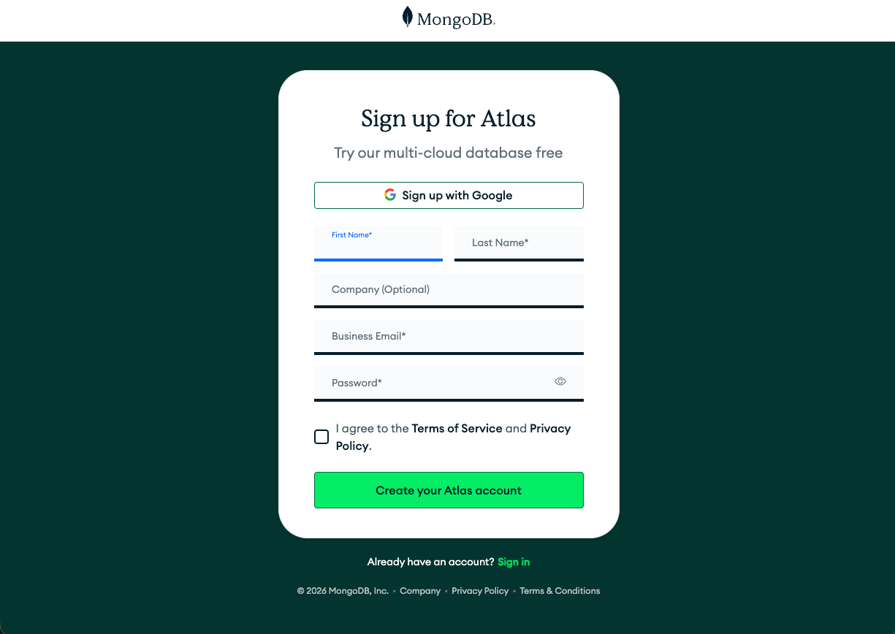

**Schritt 2 — Kostenlosen Cluster erstellen.** Nach der Anmeldung fordert Atlas dich auf, eine
Datenbank zu deployen. Wähle die **Free**-Stufe (512 MB, geteilt), wähle Cloud-Provider und Region in
deiner Nähe und klicke auf **Create Deployment**. Das Provisionieren dauert etwa eine Minute.

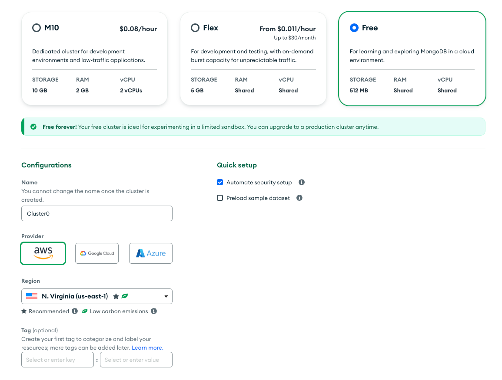

**Schritt 3 — Datenbankbenutzer erstellen.** Der Connect-Dialog von Atlas führt dich durch das
Absichern des Clusters: Er fügt deine aktuelle IP zur Zugriffsliste hinzu und legt den ersten
Datenbankbenutzer an. Notiere dir den Benutzernamen und **kopiere das Passwort** — du brauchst es
für die Verbindungszeichenfolge. Vermeide im Passwort die Zeichen `@ : / ?`; sie haben in einer
Verbindungszeichenfolge eine spezielle Bedeutung.

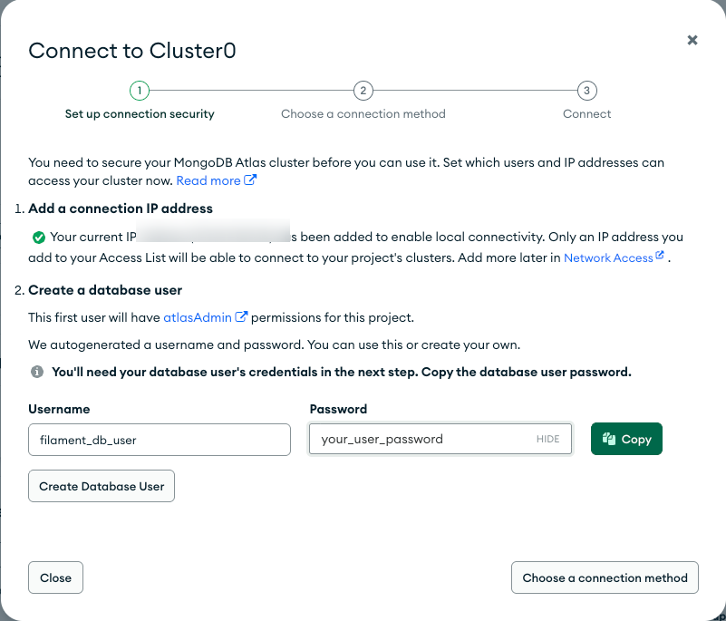

**Schritt 4 — Netzwerkzugriff erlauben.** Atlas blockt standardmäßig alle Verbindungen. Bestätige
unter **Network Access → IP Access List**, dass ein Eintrag für deine Maschine existiert (der
Connect-Flow fügt automatisch einen hinzu), oder klicke auf **Add IP Address → Allow Access from
Anywhere** (`0.0.0.0/0`), wenn du aus wechselnden Netzwerken druckst. Der Zugriff bleibt durch
Benutzername und Passwort geschützt.

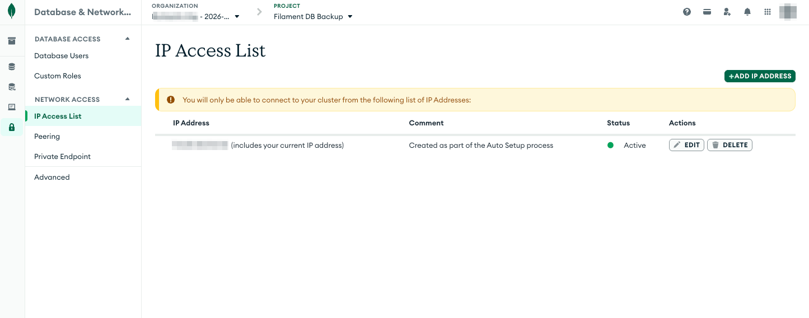

**Schritt 5 — Verbindungszeichenfolge kopieren.** Gehe zu **Database → Connect → Drivers** und
kopiere die Verbindungszeichenfolge. Sie sieht so aus:

```
mongodb+srv://filament_db_user:<db_password>@cluster0.xxxxx.mongodb.net/?appName=Cluster0
```

Ersetze `<db_password>` durch das Passwort aus Schritt 3 und bewahre die Zeichenfolge sicher auf —
du fügst sie in Schritt 8 in Filament DB ein.

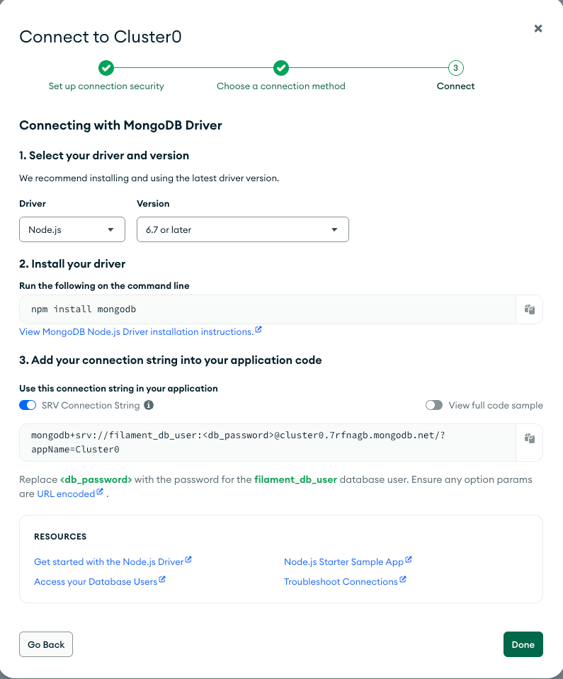

> **Tipp —** Diese Verbindungszeichenfolge ist der Schlüssel zum Teilen. Jeder, dem du sie gibst,
> sieht dieselbe Filament-Bibliothek, sodass sie für einen Partner oder eine Druckfarm funktioniert.

> **Hinweis — Lieber offline bleiben?** Die Filament-DB-Desktop-App kann vollständig lokal laufen
> oder in einem Hybrid-Modus, der bei Verbindung synchronisiert. Wenn du Local-Only wählst,
> überspringe Teil A.

### Teil B · Filament DB installieren

**Schritt 6 — Filament DB herunterladen.** Öffne die Releases-Seite unter
[github.com/hyiger/filament-db/releases](https://github.com/hyiger/filament-db/releases) und lade
die neueste Version für dein OS — die `.dmg` für macOS (separate Builds für Intel und Apple
Silicon), die `.exe` für Windows oder die `.AppImage` / `.deb` für Linux.

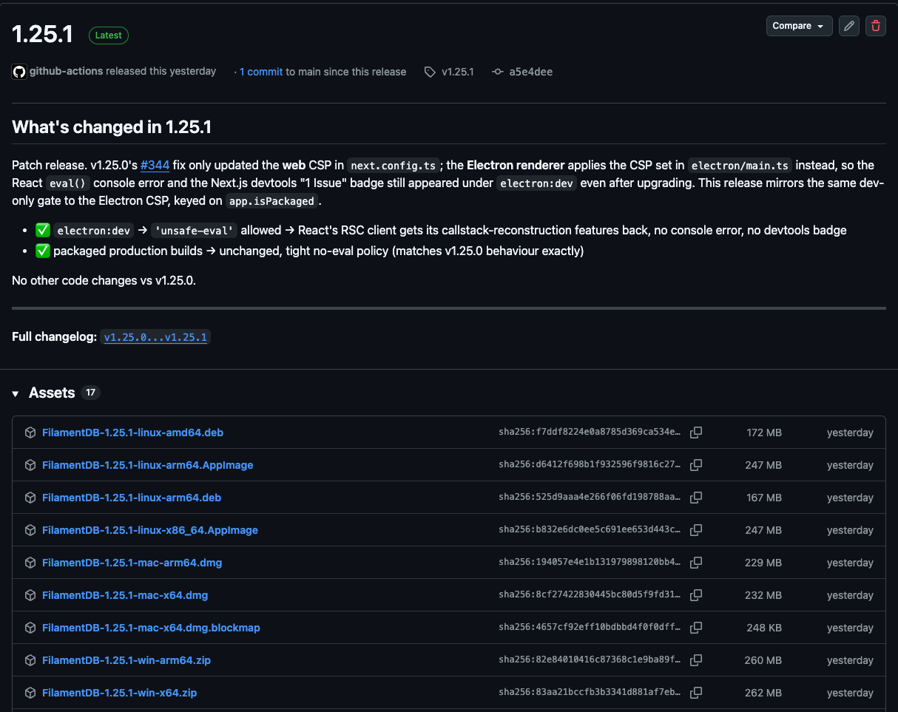

**Schritt 7 — Installiere und öffne die App.** Führe den Installer aus. Da es Community-Builds
sind, warnt dein OS möglicherweise, dass die App von einem nicht identifizierten Entwickler stammt —
auf macOS klicke beim ersten Mal mit der rechten Maustaste auf die App und wähle **Öffnen**; auf
Windows wähle **Weitere Informationen → Trotzdem ausführen**.

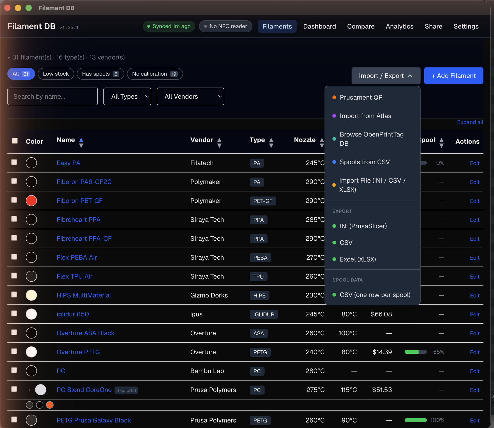

**Schritt 8 — Filament DB mit deiner Datenbank verbinden.** Öffne in Filament DB die
**Einstellungen** und scrolle zu **Verbindungsmodus**. Wähle **Atlas (Cloud)** und füge die
Verbindungszeichenfolge aus Schritt 5 ein (mit eingesetztem echten Passwort). Die drei Modi sind
Atlas (Cloud), Hybrid (Lokal + Cloud) und Offline (Nur lokal).

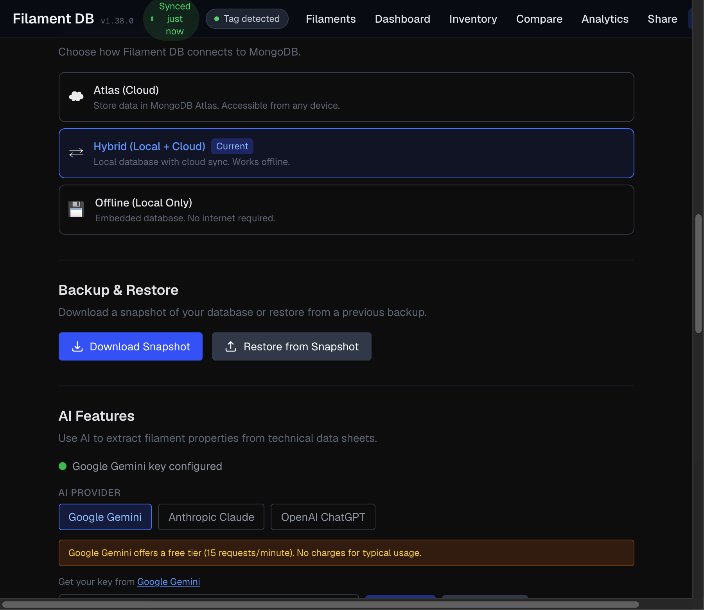

> **Tipp — Schnelltest:** Wähle auf dem Hauptbildschirm **Importieren/Exportieren → Aus Atlas
> importieren** und füge die öffentliche, schreibgeschützte Beispiel-Datenbank-Zeichenfolge des
> Entwicklers ein (aus dem Forenpost des Projekts), um eine befüllte Bibliothek zu erkunden, bevor
> du deine eigene anlegst.

> **Hinweis — Docker-Alternative:** Du kannst Filament DB stattdessen als Container betreiben:
> `docker run -p 3456:3000 -e MONGODB_URI="mongodb+srv://..." ghcr.io/hyiger/filament-db`.
> Mappt Host-Port `3456` (passend zur Desktop-App) auf Container-Port `3000`, sodass PrusaSlicers
> `http://localhost:3456` für beide funktioniert.
> Die Docker-/Web-Version kann den USB-NFC-Reader nicht nutzen — Tag-Lesen und -Schreiben benötigt
> die **Desktop**-App.

### Teil C · Externes NFC-Lesegerät einrichten

**Schritt 9 — ACS PC/SC-Treiber installieren.** Gehe zur ACS-Produktseite für den ACR1552U
([acs.com.hk](https://www.acs.com.hk)) und lade den **PC/SC Driver Installer** für dein OS
herunter. Unter Linux installiere `pcscd` und `libccid` und stelle sicher, dass der `pcscd`-Dienst
läuft.

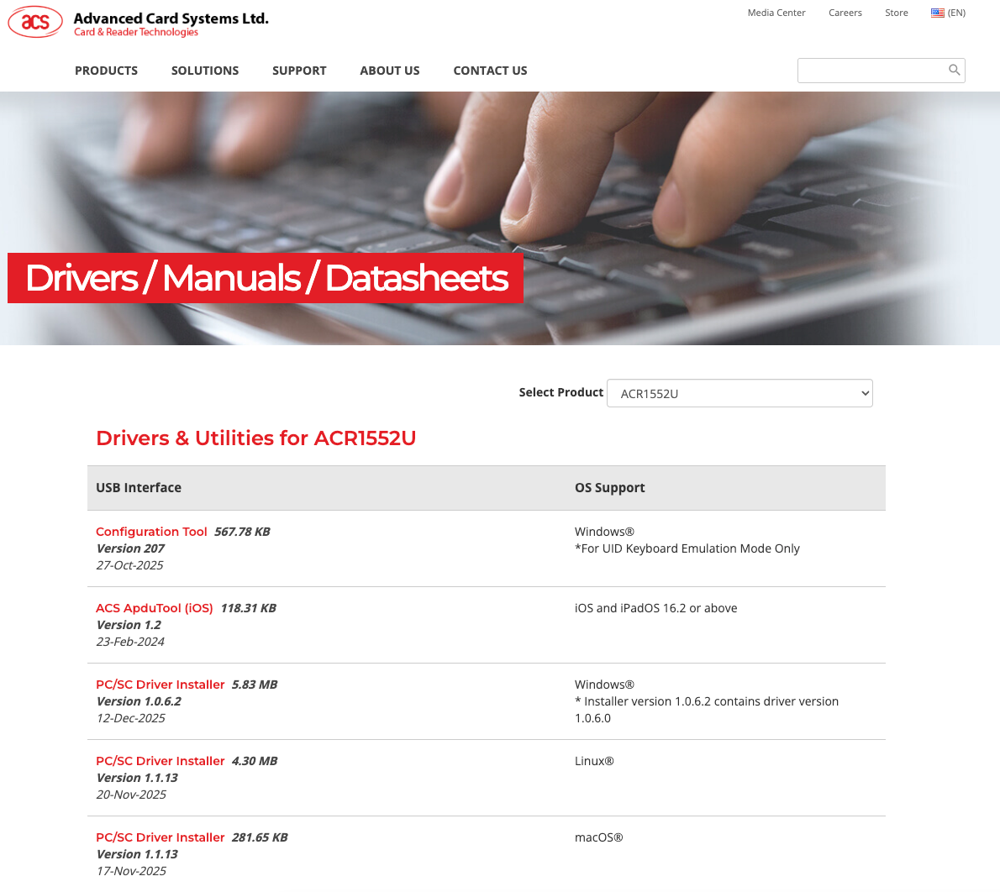

**Schritt 10 — Lesegerät anschließen und verifizieren.** Schließe den ACR1552U an einen
USB-Port an. Die Header-Status-Pille in Filament DB wechselt von „No NFC reader" zu
**„Ready — place tag"**, sobald der Reader erkannt wurde.


### Teil D · PrusaSlicer Filament Edition installieren

**Schritt 11 — PrusaSlicer-Fork herunterladen.** Öffne
[github.com/hyiger/PrusaSlicer/releases](https://github.com/hyiger/PrusaSlicer/releases) und lade
die neueste Version für dein OS herunter. Es ist ein vollständiger Fork von PrusaSlicer 2.9.5 und
installiert sich parallel zu jedem Standard-PrusaSlicer, den du bereits hast.

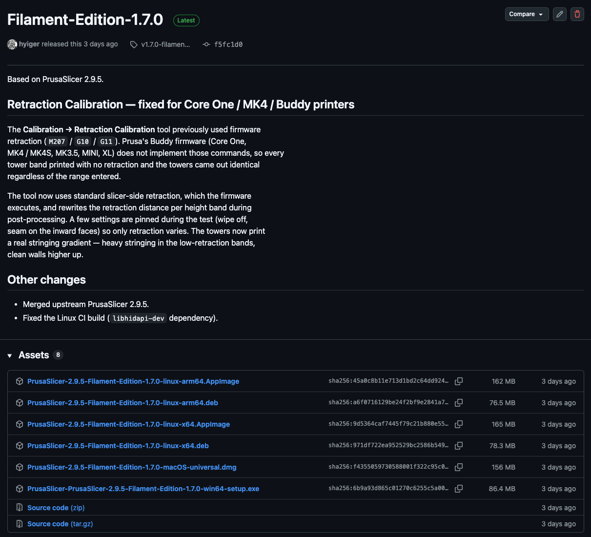

**Schritt 12 — Installieren und Erststart-Konfiguration.** Installiere ihn wie jede andere
Anwendung und durchlaufe den Konfigurations-Assistenten, um deine Drucker und Düsen einzutragen.
Die einzigen Ergänzungen gegenüber Standard-PrusaSlicer sind das **Kalibrierungs**-Menü und die
Filament-DB-Verbindung.

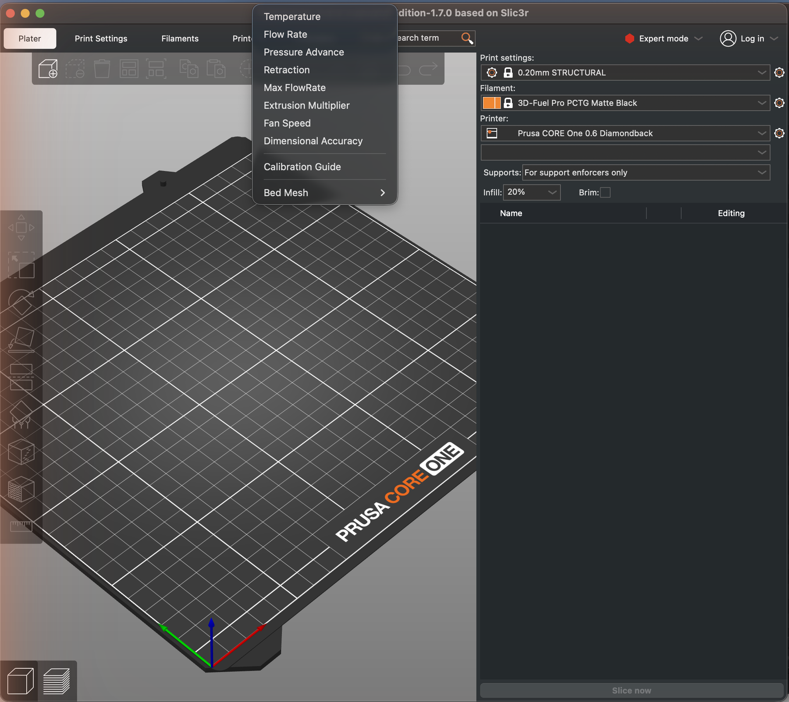

**Schritt 13 — PrusaSlicer auf Filament DB zeigen lassen.** Öffne die **Preferences** (macOS:
*PrusaSlicer → Preferences*; Windows: *Datei → Preferences*), gehe zum Tab **Other** und trage
die Adresse, unter der Filament DB läuft, in das Feld **Filament DB URL** ein. Für die aktuelle
Desktop-App ist das `http://localhost:3456`; ältere Builds und der Docker-Container nutzen Port
`3000`. Speichern und PrusaSlicer neu starten.

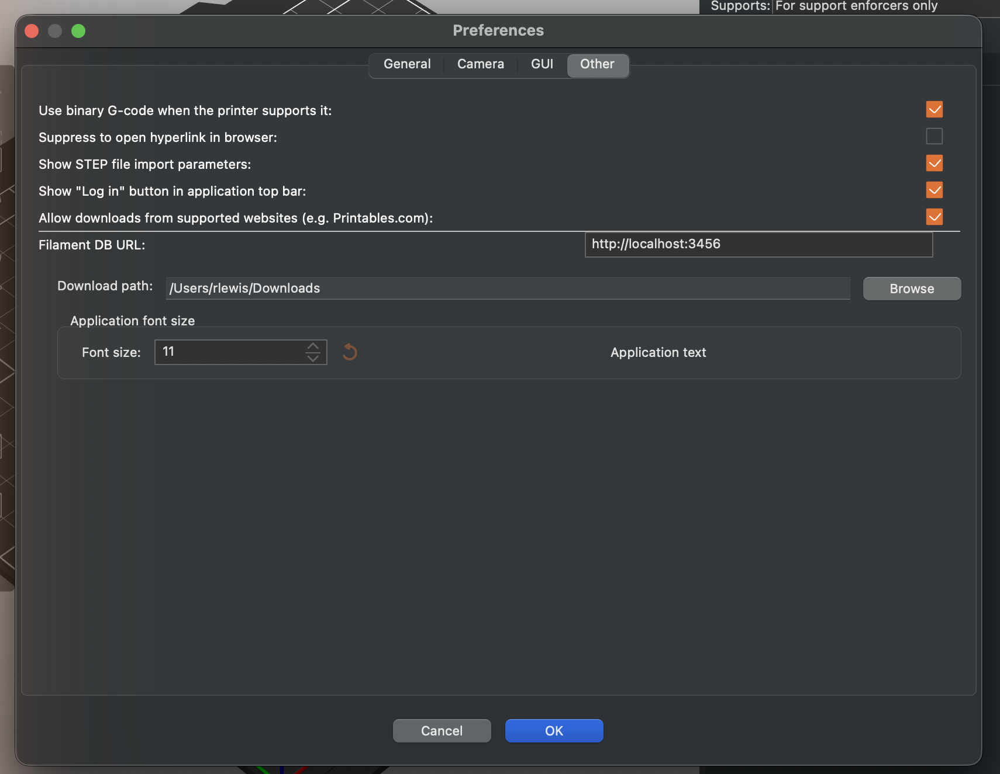

> **Warnung —** Stelle sicher, dass die URL in das Feld mit der exakten Beschriftung **Filament DB
> URL** wandert. In ein anderes Feld einzutragen ist der häufigste Einrichtungsfehler — es sieht so
> aus, als würde die Adresse „nicht angenommen".

---

## 4. Filament-Bibliothek befüllen

**Schritt 14 — Config-Bundle aus PrusaSlicer exportieren.** Wähle in PrusaSlicer **Datei →
Export → Config Bundle exportieren** und speichere die `.ini`-Datei. Sie enthält jedes
Filament-Profil mit seinen vollständigen Einstellungen.

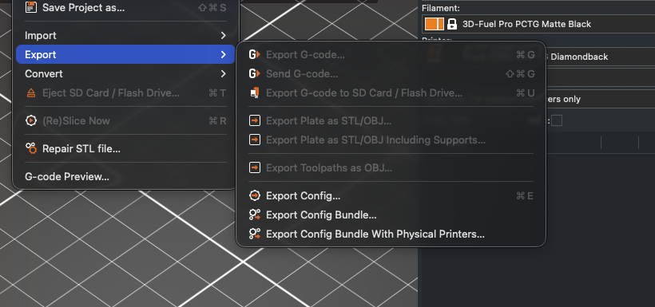

**Schritt 15 — Bundle in Filament DB importieren.** Öffne in Filament DB **Importieren/Exportieren**
und wähle den PrusaSlicer-INI-Import. Jedes Profil wird mit Temperaturen, Retraction, Pressure
Advance, Lüftereinstellungen und anderen Parametern intakt übernommen. Dasselbe Menü kann auch aus
einem Prusament-QR-Code, aus der Atlas-Filament-Datenbank, aus einer Spulen-CSV importieren oder
die OpenPrintTag-DB durchsuchen.


**Schritt 16 — Eine OpenPrintTag-Spule lesen.** Lege den Tag einer getaggten Spule auf den
ACR1552U. Filament DB liest ihn und zeigt einen **„Found in Database"**-Dialog mit jeder auf dem
Tag gespeicherten Eigenschaft — Material, Marke, Farbe, Temperaturen, Gewichte und die Instance-ID.

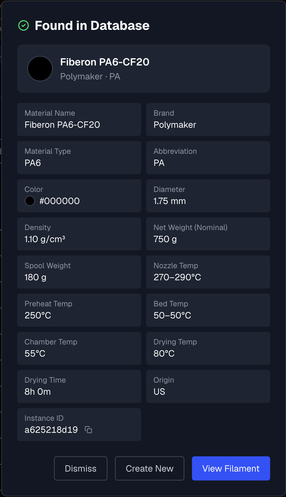

---

## 5. Filamente kalibrieren

Kalibrierung ist das, was dieses System die Mühe wert macht: ein Filament einmal einstellen, die
Zahlen speichern und nie wieder neu tunen müssen.

**Schritt 17 — Einen Kalibrierungstest durchführen.** Öffne in PrusaSlicer Filament Edition das
**Kalibrierungs**-Menü. Es bietet acht Testgeneratoren, in der empfohlenen Ausführungsreihenfolge:

| Test | Was er findet |
|------|---------------|
| 1. Temperatur | Optimale Drucktemperatur (Überhänge, Löcher, Brücken) |
| 2. Flow Rate | Extrusion Multiplier via Spiral-Top-Layer |
| 3. Pressure Advance | Bester PA-Wert, via Pro-Schicht-Chevron-Muster |
| 4. Retraction | Retraction-Abstand, via Dual-Tower-Test |
| 5. Max Flow Rate | Volumetrisches Flow-Limit deines Hotends |
| 6. Extrusion Multiplier | Feinabstimmung EM mit einem einfachen Würfel |
| 7. Fan Speed | Kühlung, via Tower mit variierenden Lüfter-Prozenten |
| 8. Dimensionsgenauigkeit | Schwindung, via XYZ-Kreuz-Lehre, gemessen mit dem Messschieber |

Jeder Test baut das Modell, platziert es auf der Plate, konfiguriert die Druckeinstellungen und
injiziert den Pro-Schicht-G-Code automatisch. Du slicest, druckst und liest das Ergebnis ab.


**Schritt 18 — Ergebnisse in Filament DB eintragen.** Öffne das getestete Filament im Filament-DB-
Editor und trage deine gemessenen Werte ein — Temperaturen, Retraction, Lüfter und andere
eingestellte Parameter. Das Seitenpanel hat Abschnitte für Kompatible Düsen und Presets, sodass
dasselbe Filament unterschiedliche Werte für jede Kombination aus Drucker, Düse und Bett halten kann.

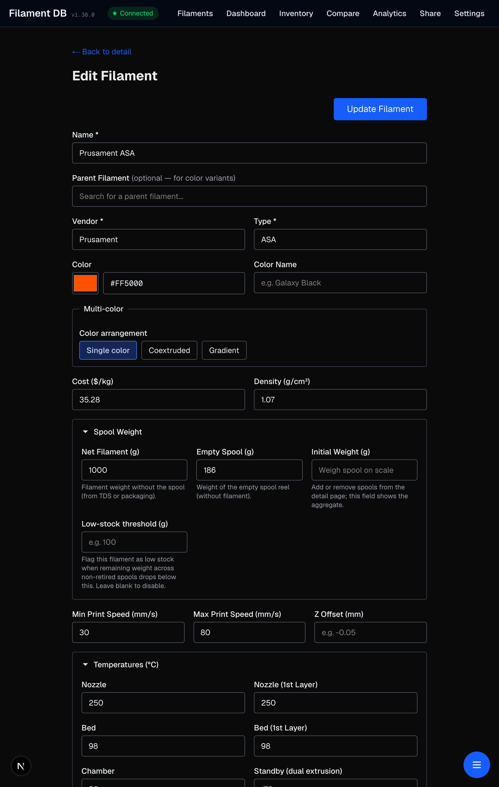

> **Tipp —** Definiere deine Drucker, Düsen und Druckbett-Typen zuerst auf der **Einstellungen**-Seite
> von Filament DB, damit jede Kalibrierung an das exakte Setup verlinkt ist, auf dem sie gemessen
> wurde.

---

## 6. Der Alltagsworkflow

Mit erledigter Einrichtung, Bibliothek und Kalibrierung ist die tägliche Nutzung der einfache Teil —
das ist die Belohnung.

**Schritt 19 — Synchronisieren.** Stelle sicher, dass Filament DB läuft, und starte dann
PrusaSlicer Filament Edition. Er kontaktiert die Filament-DB-URL aus Schritt 13 und lädt deine
Filament-Presets — mit den bereits angewandten Kalibrierungswerten. Eine kurze Benachrichtigung
bestätigt den Sync.

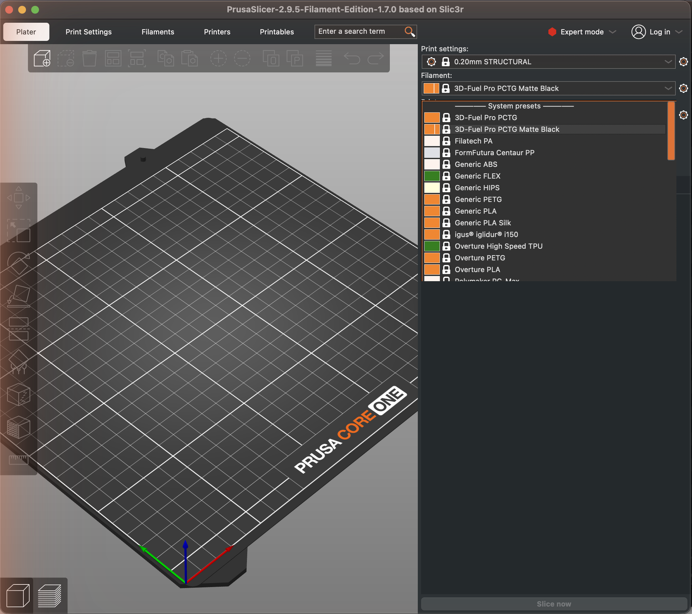

**Schritt 20 — Drucken.** Wähle dein Filament wie gewohnt aus dem PrusaSlicer-Dropdown. Da das
Preset aus Filament DB stammt, ist das kalibrierte Profil bereits aktiv. Wechsle Düse oder Drucker,
und die passenden Kalibrierungswerte folgen automatisch — kein INI-Editieren, kein Suchen in
Notizen.

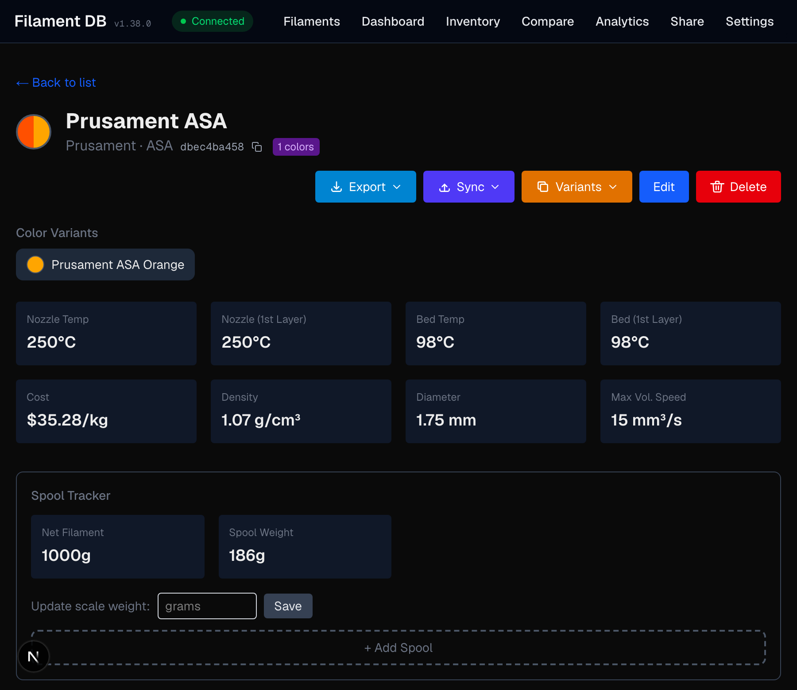

**Schritt 21 — Einen NFC-Tag für eine Spule schreiben.** Um eine physische Spule „smart" zu machen,
öffne die Detailseite dieses Filaments in Filament DB, lege einen leeren NFC-V-Tag auf den ACR1552U
und nutze **OPT exportieren** (OpenPrintTag), um die Eigenschaften des Filaments auf den Tag zu
schreiben. Ziehe den Tag ab und klebe ihn auf die Spule — von da an kann jede OpenPrintTag-
kompatible App oder jeder kompatible Drucker ihn sofort lesen. Der Spulen-Tracker auf derselben
Seite erfasst Gewicht und Restprozent; wiege eine Spule jederzeit neu, um sie aktuell zu halten.

**Schritt 22 — Tag nutzen und die Schleife schließen.** Der Tag reist mit der Spule. Tippe ihn auf
den Reader (oder einen kompatiblen Drucker), und das Filament wird sofort identifiziert. Wenn eine
Spule leer wird, ist der Tag wiederbeschreibbar — aktualisiere seine Daten und übertrage ihn auf
eine Nachfüllung. Damit ist die Schleife geschlossen: einmal kalibrieren, speichern, synchronisieren,
drucken — und den Tag die Daten an und von jeder physischen Spule tragen lassen.

---

## 7. Fehlerbehebung

| Symptom | Lösung |
|---------|--------|
| PrusaSlicer „akzeptiert" die Filament-DB-Adresse nicht | Die URL muss in das exakt mit **Filament DB URL** benannte Feld unter Preferences → Other. Fehlt das Feld, aktualisiere den Fork. |
| PrusaSlicer verbindet sich nicht / keine Presets synchronisieren | Filament DB muss laufen, wenn PrusaSlicer startet. Öffne die Desktop-App (oder starte den Container) zuerst. Bestätige, dass sie unter `http://localhost:3456` im Browser erreichbar ist (gleiche URL für Desktop und das empfohlene Docker-Port-Mapping unten). |
| Docker-Container läuft, aber PrusaSlicer erreicht ihn nicht | Der Container muss den Port veröffentlichen: füge `-p 3456:3000` zum `docker run`-Befehl hinzu, sodass Host-Port 3456 (der Desktop-Default, den PrusaSlicer erwartet) auf Container-Port 3000 mappt. |
| Filament DB verbindet sich nicht zu MongoDB Atlas | Prüfe, dass Network Access deine IP (oder `0.0.0.0/0`) erlaubt, dass das Passwort keine nicht-escapten Zeichen `@ : / ?` enthält und dass `<db_password>` tatsächlich durch das echte Passwort ersetzt wurde. |
| Der ACR1552U-Reader wird nicht erkannt | Installiere den ACS-PC/SC-Treiber und schließe den Reader neu an. NFC funktioniert nur in der **Desktop**-App, nicht in der Web-/Docker-Version. |
| Ein Tag lässt sich nicht beschreiben | Nutze NFC-V- / ISO-15693-Tags (NXP ICODE SLIX2, 320 Bytes) oder einen echten leeren OpenPrintTag. Zentriere den Tag auf dem Reader und halte ihn still. |
| Eine Bambu-Spule wird als „read-only" angezeigt | Erwartet — Bambu-Tags sind kryptografisch signiert, daher können sie gelesen, aber nicht überschrieben werden. |
| Verhalten ist seltsam nach einem Update | Filament DB und der PrusaSlicer-Fork entwickeln sich schnell und sind dafür gemacht, gemeinsam aktualisiert zu werden. Aktualisiere beide auf passende neue Releases. |

---

## 8. Schnellreferenz

**Der Workflow auf einen Blick**

| Phase | Werkzeug | Was passiert |
|-------|----------|--------------|
| Kalibrieren | PrusaSlicer Filament Edition | Einen Test im Kalibrierungs-Menü ausführen, drucken, Ergebnis ablesen |
| Speichern | Filament DB | Werte pro Drucker + Düse + Druckbett-Typ ablegen |
| Synchronisieren | Filament DB → PrusaSlicer | Presets laden beim Start mit angewandten Kalibrierungswerten |
| Drucken | PrusaSlicer Filament Edition | Filament wählen; korrekte Einstellungen folgen Düse/Drucker |
| Taggen | Filament DB + ACR1552U | OpenPrintTag-NFC-Tag schreiben; auf die Spule kleben |

**Wichtige Einstellungen**

| Einstellung | Wert |
|-------------|------|
| Atlas-Cluster-Stufe | Free (512 MB, geteilt) |
| Atlas-Netzwerkzugriff | `0.0.0.0/0` (überall erlauben) oder deine IP |
| PrusaSlicer → Preferences → Other | Filament DB URL = `http://localhost:3456` (sowohl Desktop als auch Docker mit dem empfohlenen Port-Mapping) |
| Docker-Port-Mapping | `-p 3456:3000` |
| NFC-Tag-Typ | NFC-V / ISO 15693 — NXP ICODE SLIX2 (320 Bytes) |
| NFC-Reader | ACS ACR1552U (nur Desktop-App) |

**Links**

| Ressource | Adresse |
|-----------|---------|
| OpenPrintTag — Standard & Info | [openprinttag.org](https://openprinttag.org) |
| Filament DB — Releases | [github.com/hyiger/filament-db/releases](https://github.com/hyiger/filament-db/releases) |
| PrusaSlicer Filament Edition — Releases | [github.com/hyiger/PrusaSlicer/releases](https://github.com/hyiger/PrusaSlicer/releases) |
| MongoDB Atlas | [mongodb.com/atlas](https://www.mongodb.com/atlas) |
| ACR1552U-Reader & Treiber | [acs.com.hk](https://www.acs.com.hk) — ACR1552U USB NFC Reader IV |

---

*Filament DB und PrusaSlicer Filament Edition sind unabhängige, von der Community entwickelte Projekte;
OpenPrintTag ist der von Prusa getragene offene Standard. Menünamen, Button-Beschriftungen und
Versionsnummern ändern sich mit der Zeit — wenn etwas nicht zu dieser Anleitung passt, vertraue der
aktuellen App.*
